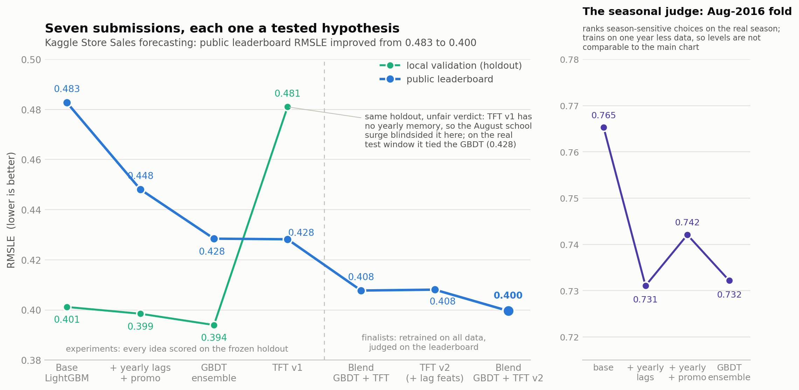
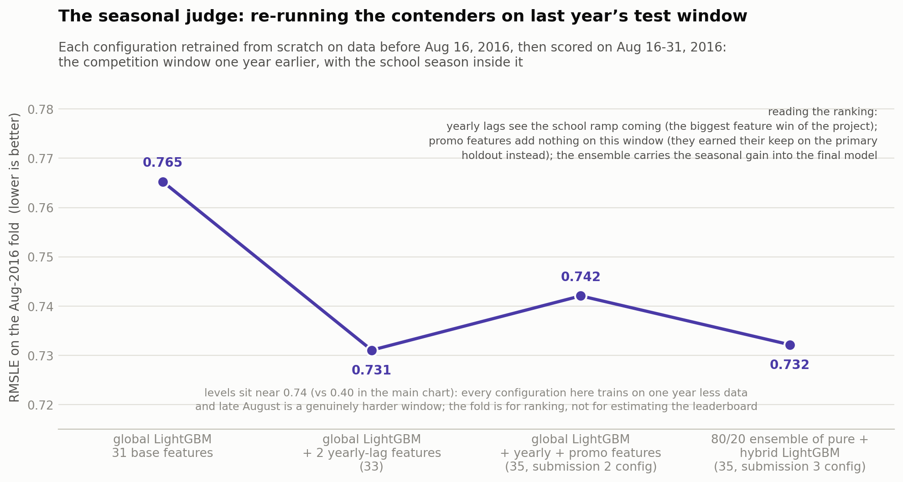
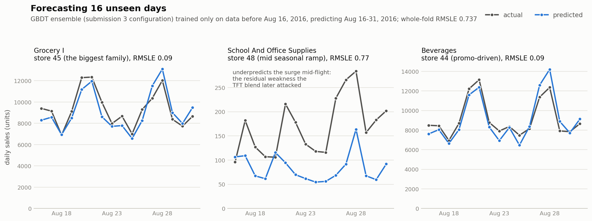
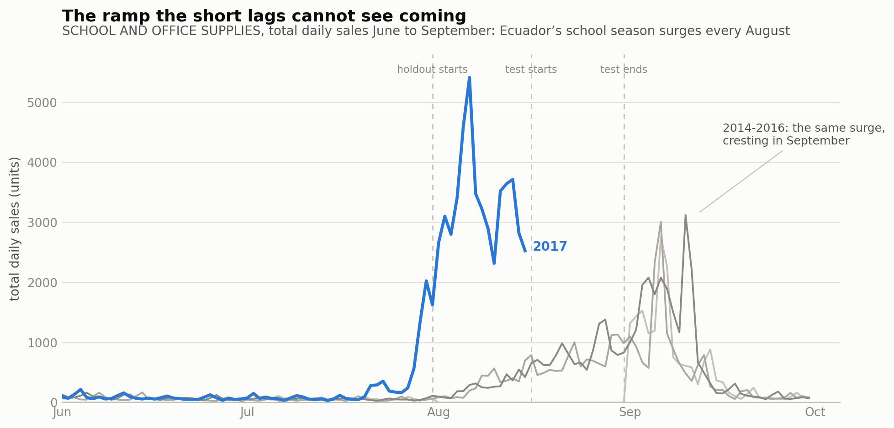

# Store Sales: Time Series Forecasting

Forecasting 16 days of daily unit sales for 54 stores × 33 product families (~1,800 series, 3M training rows) of the Ecuadorian grocery chain Corporación Favorita, for the Kaggle competition [Store Sales - Time Series Forecasting](https://www.kaggle.com/competitions/store-sales-time-series-forecasting).

**Result: public leaderboard RMSLE improved from 0.483 to 0.400 across 7 submissions**, each one a tested hypothesis rather than blind tuning.

## Approach

| # | Configuration | Local validation | Public LB |
|---|---|---|---|
| 1 | Global LightGBM on `log1p(sales)`, 31 engineered features | 0.4012 | 0.48279 |
| 2 | + yearly-lag (364d) & promotion-intensity features | 0.3985 | 0.44810 |
| 3 | Ensemble: 80% pure LightGBM + 20% hybrid (linear trend/Fourier stage, then LightGBM on its residuals) | 0.3940 | 0.42844 |
| 4 | Temporal Fusion Transformer v1: raw 56-day sequences + covariates | 0.4810 | 0.42820 |
| 5 | 50/50 log-scale blend of #3 and #4 | n/a | 0.40775 |
| 6 | TFT v2: engineered lags fed as known-future exogenous inputs, per-series prediction cap | n/a | 0.40810 |
| 7 | 50/50 log-scale blend of #3 and #6 | n/a | **0.39962** |

Submissions 1-4 are the experiment phase: every model was also fitted on pre-holdout data, so each idea got an honest local score. Submissions 5-7 are the finalist phase: the two proven contenders (the GBDT ensemble and the TFT) were retrained on the full dataset, and their prediction files were blended 50/50 on the log scale. Submission 5 blends the GBDT ensemble with TFT v1, submission 6 is the improved TFT v2 on its own, and submission 7 blends the GBDT ensemble with TFT v2. These outputs only exist for the real test window, and by then the holdout had twice been shown to misjudge late-August value, so the Aug-2016 fold and the leaderboard were the only honest judges left. Hyperparameter tuning was deliberately deferred throughout: early stopping set the tree counts, and feature work moved the score more than any parameter would.

The submission 1 leaderboard gap was caused by the primary holdout ending on Aug 15, right before Ecuador's school season, so it structurally under-credits anything whose value sits in late August. The fix was a second judge: the competition window one year earlier (Aug 16-31, 2016, school surge included), with every candidate retrained from scratch on data before that date. All four candidates below are LightGBM (GBDT) configurations, because refitting a TFT costs another full training run. This fold is what kept the yearly lags (its biggest win, 0.765 to 0.731), refused to credit promo features for seasonal value, and confirmed the ensemble. Its levels sit far above the main chart's because each model trains on one year less data on a genuinely harder window: it ranks candidates, it never estimates the leaderboard.

And this is what the winning configuration from that chart (its right-most point, the 80/20 LightGBM ensemble) looks like against reality on the same fold, for three representative series:

## Three lessons, each confirmed on the leaderboard

1. **Validation-window placement matters.** Submission 1 scored 0.08 worse on the leaderboard than locally. The cause was seasonal: the test window (Aug 16-31) contains the school-shopping ramp that the holdout (Jul 31 to Aug 15) only starts to show. The fix was an additional validation fold on Aug 16-31 of *2016*, the same season one year earlier, to judge season-sensitive features fairly. The same effect later made TFT v1 look bad locally (0.481) while it tied the GBDT ensemble on the real test window (0.428).

   

2. **Diversity drives blends.** Two models scoring around 0.428 each, erring differently (mean absolute log-difference 0.15), blended to 0.408.

3. **Feature engineering lifts neural models too.** Feeding the engineered lag features into the TFT as known-future exogenous inputs took it from 0.428 to 0.408, with no year-long input window needed. One production-style guard was required: a per-series cap at 2× the historical max, because the net over-extrapolated the school ramp to 22k-78k units on 8 rows (an error class trees cannot make).

## Notebooks (in order)

| Notebook | Contents |
|---|---|
| `notebooks/01_eda.ipynb` | EDA with per-section takeaways, ending in a concrete preprocessing and modelling plan |
| `notebooks/02_preprocessing.ipynb` | Holiday-table parsing, calendar features, leak-free lag/rolling features (all shifts ≥ 16 days), panel assembly |
| `notebooks/03_lightgbm.ipynb` | Frozen holdout + baselines, global LightGBM, experiment log, error analysis, the leaderboard-gap investigation |
| `notebooks/04_hybrid_ensemble.ipynb` | Hybrid model (linear trend + Fourier stage, LightGBM on the residuals) and a weighted ensemble |
| `notebooks/05_tft_v1.ipynb` | TFT v1: raw sequences + static/known-future/observed covariates (NeuralForecast) |
| `notebooks/06_tft_v2.ipynb` | TFT v2: engineered lags as exogenous inputs, per-series sanity cap, final blend |

## Reproducing

1. Download the competition data into `data/` with the Kaggle CLI:
   `kaggle competitions download -c store-sales-time-series-forecasting -p data --unzip`
2. Create the environment: `conda env create -f environment.yml`
3. Run the notebooks in order. `02_preprocessing.ipynb` writes `data/processed/*.pkl`, which the modelling notebooks consume.

Everything trains on a laptop: the LightGBM configurations fit in minutes on CPU and the TFTs train in under an hour on Apple Silicon.
