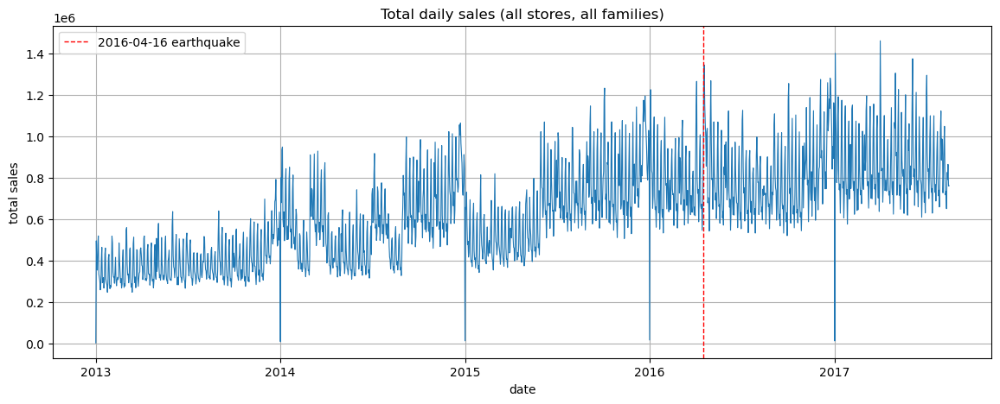
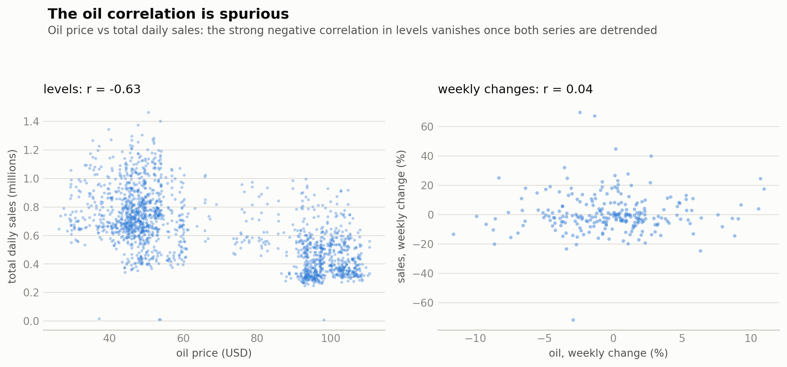

# Store Sales: Time Series Forecasting

Forecasting 16 days of daily unit sales for 54 stores × 33 product families (~1,800 series, 3M training rows) of the Ecuadorian grocery chain Corporación Favorita, for the Kaggle competition [Store Sales - Time Series Forecasting](https://www.kaggle.com/competitions/store-sales-time-series-forecasting).

**Result: public leaderboard RMSLE improved from 0.483 to 0.400 across 7 submissions**, each one a tested hypothesis rather than blind tuning.

## Results

| # | Configuration | Local validation | Public LB |
|---|---|---|---|
| 1 | Global LightGBM on `log1p(sales)`, 31 engineered features | 0.4012 | 0.48279 |
| 2 | + yearly-lag (364d) & promotion-intensity features | 0.3985 | 0.44810 |
| 3 | Ensemble: 80% pure LightGBM + 20% hybrid (linear trend/Fourier stage, then LightGBM on its residuals) | 0.3940 | 0.42844 |
| 4 | Temporal Fusion Transformer v1: raw 56-day sequences + covariates | 0.4810 | 0.42820 |
| 5 | 50/50 log-scale blend of #3 and #4 | n/a | 0.40775 |
| 6 | TFT v2: engineered lags fed as known-future exogenous inputs, per-series prediction cap | n/a | 0.40810 |
| 7 | 50/50 log-scale blend of #3 and #6 | n/a | **0.39962** |

Submissions 1-4 are the experiment phase: every model was also fitted on pre-holdout data, so each idea got an honest local score. Submissions 5-7 are the finalist phase: the two proven contenders (the GBDT ensemble and the TFT) were retrained on the full dataset, and their prediction files were blended 50/50 on the log scale. These outputs only exist for the real test window, and by then the holdout had twice been shown to misjudge late-August value, so the Aug-2016 fold and the leaderboard were the only honest judges left. Hyperparameter tuning was deliberately deferred throughout: early stopping set the tree counts, and feature work moved the score more than any parameter would.

## The approach: every model chosen for the gap the previous one left

**The data dictated the setup.** Four EDA findings carried direct consequences:

- The target is heavily right-skewed (skew 7.4) and 31% of all rows are exact zeros, so every model trains on `log1p(sales)`. That also turns the competition metric, RMSLE, into plain RMSE.
- The week is the strongest rhythm in the data: autocorrelation peaks at multiples of 7 (lag-7 r = 0.83, higher than lag-1) and Sundays sell 63% more than Thursdays. So the lag features align to the weekly cycle.
- Every outlier turned out to be explainable: Jan 1 closures, paydays mid-month and at month-end, the April 2016 earthquake. I kept them and turned them into features (payday flags, holiday distances, an earthquake flag parsed from the holiday table) instead of deleting rows.
- Daily sales correlate with the oil price at r = −0.63, which looks like a strong driver until you detrend both series and the correlation collapses to 0.04. Two co-trending lines, nothing more. Oil stayed in as a background covariate and got no features.

**Features under one rule.** The forecast horizon is 16 days, so every feature built from sales history uses shifts of at least 16 days: lags 16/21/28, rolling statistics on the 16-day-old level, a dead-series flag. Promotions are the exception, since the test set ships with them, so promo windows may run up to the current day. Before any feature work I repaired the data structurally: reinserted the four missing Christmas days with zero sales (a row-based shift would otherwise silently misalign every lag across that boundary), dropped the pre-opening rows of seven stores, forward-filled oil over a full calendar, and parsed the holiday table for transfers, bridge days and compensating workdays. The result is a feature set where every column is computable for every test day, the same way it would be in production.

**Honest yardsticks before any model.** I froze a time-based holdout (the last 16 training days) and set two naive baselines: same weekday three weeks ago scores 0.633, a 28-day rolling mean 0.550. Anything I build has to earn its keep against those.

**Why start with a global LightGBM?** Tabular data with engineered features is home turf for gradient-boosted trees. One model across all 1,782 series learns cross-series structure (store types, family behaviour), handles the categoricals natively, and refits in minutes, which is what made fast experimenting possible in the first place. I also knew the two structural weaknesses I was signing up for: trees can't extrapolate beyond the levels they saw in training, and they only know what you put in their feature columns. Submission 1: holdout 0.401, leaderboard **0.483**.

**That 0.08 gap was the second weakness in action.** Rerunning the same setup on earlier windows gave stable rankings, so my validation procedure was fine; the gap belonged to the window itself. Error analysis by family pointed at SCHOOL AND OFFICE SUPPLIES, which surges every August ahead of Ecuador's school year. The ramp sits inside the test window, and features with a 28-day memory can't see it coming. Two fixes: yearly-lag features (same weekday, one year back) so the model gets that memory, and a second validation fold on the competition window one year earlier, because the primary holdout structurally under-credits late-August value. Submission 2: **0.448**.

Every candidate on that fold is retrained from scratch on data before Aug 16, 2016. All four are LightGBM (GBDT) configurations: a LightGBM refit takes minutes, which made it the vehicle for fast feature experiments, while the TFTs (about an hour per refit) were judged on the leaderboard directly. The fold is what kept the yearly lags (0.765 to 0.731), refused to credit promo features for seasonal value, and confirmed the ensemble. Its levels sit far above the main chart's because each model trains on one year less data on a genuinely harder window: it ranks candidates, it never estimates the leaderboard.

**Why add a linear model next?** Because it does the one thing trees can't. A calendar-only linear stage (trend, yearly Fourier waves, weekly dummies) extrapolates calmly past the training boundary. On its own it scores 0.922, since it knows nothing about promotions or paydays, so it plays the skeleton role and a LightGBM learns its residuals. To be fair to the numbers: this hybrid (0.440) lost to the pure model (0.398) on the holdout, because on a 16-day horizon the lag features already carry the level. But the two make different mistakes, and an 80/20 ensemble of pure and hybrid beat both, on both validation windows. Submission 3: **0.428**. That became the recurring theme of this project: combinations pay through difference, not strength.

**Why bring in a neural net?** Everything so far only knows what I engineered. A Temporal Fusion Transformer is the opposite paradigm: it consumes the raw 56-day sequence, learns its own representations, and has native slots for static, known-future and observed covariates. The bet was that 3M rows is enough data for that to work. Raw, it tied the GBDT ensemble on the leaderboard (0.428) while my holdout claimed 0.481, the same holdout bias as before, second occurrence. Its weaknesses turned out to be mirror images of the trees': memory that ends at 56 days, so it can't see last August, and extrapolation without bounds where trees can't extrapolate at all. Blending it with the GBDT ensemble (their errors differ, mean log-difference 0.15) gave **0.408**.

**TFT v2: closing the memory gap without paying for it.** A year-long input window would cost roughly 7× the training time. Feeding the engineered lag features in as known-future inputs costs nothing, and it took the TFT to **0.408** on its own, the strongest single model of the project. The over-reach weakness showed up exactly where expected: eight school-supplies predictions of 22,000 to 78,000 units against recent levels in the hundreds. A per-series cap at twice the historical maximum (58 of 28,512 predictions) handled it. The final blend of GBDT ensemble and TFT v2, still erring differently even with shared features: **0.39962**.

And this is what the best GBDT configuration from the seasonal-judge chart (its right-most point, the 80/20 LightGBM ensemble, later one half of the final blend) looks like against reality on the same fold, for three representative series:

## Three lessons, each confirmed on the leaderboard

1. **Validation-window placement matters.** Submission 1 scored 0.08 worse on the leaderboard than locally. The cause was seasonal: the test window (Aug 16-31) contains the school-shopping ramp that the holdout (Jul 31 to Aug 15) only starts to show. The fix was an additional validation fold on Aug 16-31 of *2016*, the same season one year earlier, to judge season-sensitive features fairly. The same effect later made TFT v1 look bad locally (0.481) while it tied the GBDT ensemble on the real test window (0.428).

2. **Diversity drives blends.** Two models scoring around 0.428 each, erring differently (mean absolute log-difference 0.15), blended to 0.408.

3. **Feature engineering lifts neural models too.** Feeding the engineered lag features into the TFT as known-future exogenous inputs took it from 0.428 to 0.408, with no year-long input window needed. One production-style guard was required: a per-series cap at 2× the historical max, because the net over-extrapolated the school ramp to 22k-78k units on 8 rows (an error class trees cannot make).

## Notebooks (in order)

| Notebook | Contents |
|---|---|
| `notebooks/01_eda.ipynb` | EDA with per-section takeaways, ending in a concrete preprocessing and modelling plan |
| `notebooks/02_preprocessing.ipynb` | Holiday-table parsing, calendar features, leak-free lag/rolling features (all shifts ≥ 16 days), panel assembly |
| `notebooks/03_lightgbm.ipynb` | Frozen holdout + baselines, global LightGBM, experiment log, error analysis, the leaderboard-gap investigation |
| `notebooks/04_hybrid_ensemble.ipynb` | Hybrid model (linear trend + Fourier stage, LightGBM on the residuals) and a weighted ensemble |
| `notebooks/05_tft_v1.ipynb` | TFT v1: raw sequences + static/known-future/observed covariates (NeuralForecast) |
| `notebooks/06_tft_v2.ipynb` | TFT v2: engineered lags as exogenous inputs, per-series sanity cap, final blend |

## Reproducing

1. Download the competition data into `data/` with the Kaggle CLI:
   `kaggle competitions download -c store-sales-time-series-forecasting -p data --unzip`
2. Create the environment: `conda env create -f environment.yml`
3. Run the notebooks in order. `02_preprocessing.ipynb` writes `data/processed/*.pkl`, which the modelling notebooks consume.

Everything trains on a laptop: the LightGBM configurations fit in minutes on CPU and the TFTs train in under an hour on Apple Silicon.
